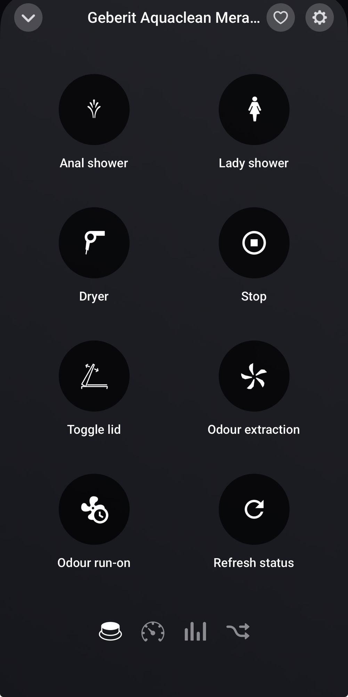
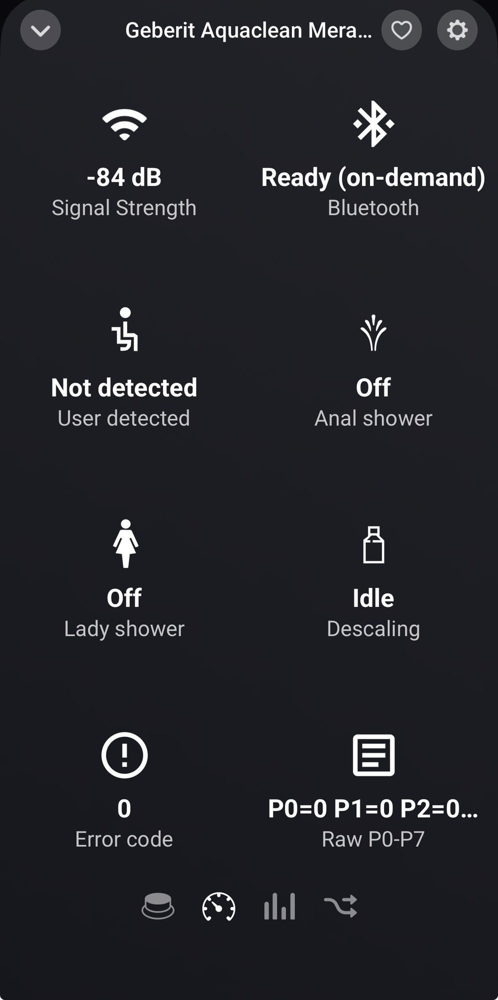
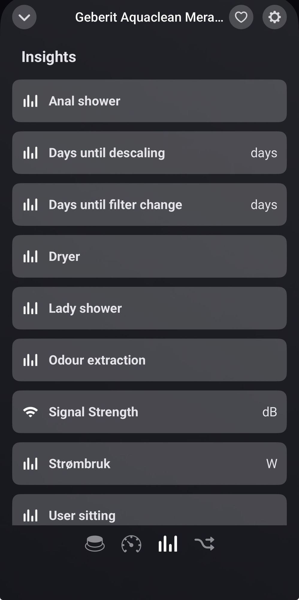

# Geberit AquaClean for Homey

Control a **Geberit AquaClean** shower toilet from a Homey Pro,
over Bluetooth LE through an **ESP32 running ESPHome as a Bluetooth proxy**.
No cloud, no Geberit account — everything stays on your own network.

The app speaks the ESPHome native API (protobuf over TCP) directly and does
raw GATT through the proxy. Homey's own Bluetooth radio is not used, which
means the toilet does not need to be within Homey's range — only within the
ESP32's.

## Screenshots

Click to enlarge.

<p>
  <a href="docs/screenshots/device-controls.jpg"></a>
  <a href="docs/screenshots/device-status.jpg"></a>
  <a href="docs/screenshots/insights.jpg"></a>
</p>

## Architecture

```
Homey Pro ──TCP 6053──> ESP32 (ESPHome bluetooth_proxy) ──BLE──> AquaClean
```

- **On-demand connections**: the toilet accepts a single BLE central at a
  time, and its physical remote is dead while anyone is connected. The app
  therefore connects briefly (~2 s), does its work, and disconnects. Poll
  intervals and the keep-warm window are user-configurable.
- **Verified writes**: every setting written is read back from the toilet
  before it is reported as saved.
- **Self-healing**: after repeated failures a three-stage circuit breaker
  works through proxy cache clear → proxy restart → internal transport reset,
  30 minutes apart, and resets as soon as a connection succeeds.

## Requirements

- A Geberit AquaClean. Developed and tested against a Mera Comfort; other
  models share the same Bluetooth protocol and are likely to work, but are
  untested — reports from other models are very welcome.
- An ESP32 running ESPHome as a Bluetooth proxy. A complete, tested
  configuration is included: **[`esphome/geberit-aquaclean-proxy.yaml`](esphome/geberit-aquaclean-proxy.yaml)**.
  Set your WiFi secrets and the fallback AP password, then flash it.

  A basic ESP32-C3 is enough — the config is tuned for one, with BLE 5.0
  disabled to free RAM. A classic ESP32 works too; drop the `esp32:` block
  and use your board's own settings.

Place the ESP32 within a few metres of the toilet with clear line of sight —
BLE range is the single most common source of trouble. Aim for an RSSI
better than −80 dBm; connections start failing around −87 dBm, and a human
body between the ESP32 and the toilet costs about 13 dB. That last point
matters more than it sounds: the signal is weakest exactly when someone is
sitting on the toilet, which is when the app is most likely to be used.

Two details in the proxy config are load-bearing:

- `connection_slots: 1` and `active: true` — the AquaClean needs two-way
  GATT, and one slot is all it will grant.
- The **restart** and **factory reset** buttons. The Homey app presses these
  itself after repeated failures to recover a wedged proxy; without them it
  cannot self-heal.

## Setup

1. Install the app, open its settings, and enter the ESP32's IP address.
2. Add the device: the pairing dialog scans through the proxy and lists any
   AquaClean it sees.
3. Optional: adjust poll intervals and the Bluetooth keep-warm window under
   the device's settings.

## What was learned about the protocol

Highlights that go beyond the prior art, all verified against a live Mera
Comfort:

- ESPHome's `BluetoothGATTNotifyRequest` does **not** write the CCCD
  descriptor — it only registers the callback locally on the ESP32. Without
  a manual descriptor write the toilet never sends a single notification.
- The 0x11/0x13 session-initialization handshake is unnecessary for request/
  response use: dropping it took a request from 6.3 s to 1.9 s.
- Profile-setting payloads start with the **profile id** (0–4). Profile 0 is
  the toilet's "base settings" — what it uses when no user profile is
  selected — and cannot be read as "active profile": no readable field
  reflects which profile is active.
- Stored profile values are read when a function **starts**; writing them
  mid-shower changes nothing. The remote adjusts pressure live through a
  channel that is not exposed over this GATT service.
- Command 37, inherited as `TRIGGER_FLUSH`, is acknowledged with status 0
  but does nothing observable on a Mera Comfort — tested with the seat both
  empty and occupied. A Mera has no bowl flush of its own, so the name is
  probably wrong. Not exposed in the app.

## Credits

This app builds directly on the protocol research of
[jens62/geberit-aquaclean](https://github.com/jens62/geberit-aquaclean) —
UUID roles, frame format, CRC behaviour and the procedure map all trace back
to that project, and several capability icons come from its `graphics/`
directory. See [THIRD_PARTY_NOTICES.md](THIRD_PARTY_NOTICES.md) for the full
attribution, including Material Design Icons by Pictogrammers.

[thomas-bingel/geberit-aquaclean](https://github.com/thomas-bingel/geberit-aquaclean)
served as an additional protocol reference.

## Development

```bash
npm test                                # 94 unit tests, no hardware needed
homey app validate --level publish
homey app install                       # deploy to your Homey
```

The `test/` suite covers the frame protocol, the ESPHome API encoding, the
device state machine (queueing, keep-warm, backoff, circuit breaker) and
app.json↔code consistency.

## License

MIT — see [LICENSE](LICENSE). Third-party artwork and references are listed
in [THIRD_PARTY_NOTICES.md](THIRD_PARTY_NOTICES.md).

*This is a community project with no affiliation to Geberit AG. Geberit and
AquaClean are trademarks of Geberit AG, used here only to identify the
compatible product.*
