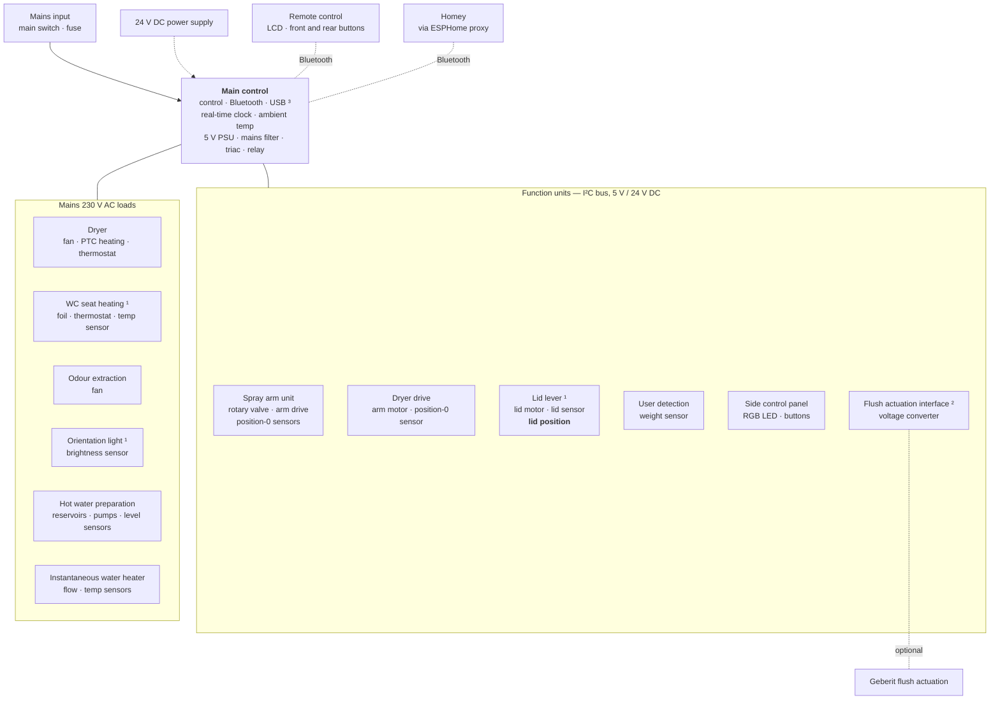

# What the AquaClean exposes over Bluetooth

The Mera Comfort's BLE interface, mapped by measurement rather than
assumption. Everything below was verified against a live Mera Comfort
(RS30.0 TS206) through an ESPHome bluetooth_proxy on 2026-08-18, with the
method and timestamps kept so the claims can be checked or disproved.

Where this disagrees with prior art it says so. Two devices of the same model
family do not necessarily report the same things in the same places.

---

## Architecture

Redrawn from the electronic functional diagram in the Geberit service manual
`967.008.00.0(04)`. The facts are Geberit's; this rendering is ours.

¹ Mera Comfort only.  ² Optional interface module, sold separately.
³ Factory programming only — see below.

The point of the diagram for this app: **the lid sensor reports to the lid
lever module, which talks to the main control over the internal I²C bus.**
Homey sits on the other side of the main control's Bluetooth. Whether an
internal signal is visible from there is a separate question from whether the
hardware measures it — and for the lid, the answer turns out to be no.

---

## System parameters (`GetSystemParameterList`, procedure `0x0D`)

The app's live state. Each row below was confirmed by sending the command and
watching which index answered.

| Index | Meaning | How it was confirmed |
|---|---|---|
| 0 | User present | Followed sitting down and standing up |
| **1** | **Anal shower running** | Command sent 22:27-ish; high 68.2 s and 69.2 s across two runs |
| **2** | **Lady shower running** | Command 1 sent 22:27:48 → index 2 rose 22:27:50, high 59 s |
| **3** | **Dryer running** | Command 2 sent 22:30:04 → index 3 rose 22:30:06 |
| 4 | Descaling state | 0 idle, 1 preparing, 2 waiting, 3 running |
| 5 | Descaling minutes | Counts down during state 3 |
| 6 | **Last error** | See [ERROR_CODES.md](ERROR_CODES.md) |
| 7 | Service state | Normally 0; observed as 3 once, cleared by itself |
| 8–10 | — | **Rejected with status `0x80`** on this device |
| 11–14 | Unknown | Readable, values 0 / 11 / 13 / 10, meaning not established |

Both showers and the dryer answered **two seconds after** the command, which
fits the parameter being set when the function actually starts rather than
when the command is received.

### This differs from other hardware

jens62's device (`HB2304EU298413`) reports the **anal shower on index 3**, and
records index 1 as *"always 0 in all monitored sessions including with user
seated and showers running"*. On this Mera Comfort index 1 is the anal shower
and index 3 is the dryer — both confirmed by command.

The app carries a device setting for exactly this (`anal_status_parameter`,
choice of 1 or 3). The measurements above are why that setting exists and why
its default is 1.

### Eight parameters per request is the safe limit

A `GetSystemParameterList` request whose parameter IDs run past the end of the
first BLE frame and into a continuation frame answers normally — and then
leaves the toilet unable to answer `GetFilterStatus` (`0x59`) at all. The
state survives reconnecting, a different client, and restarting the proxy.
Only cycling mains power on the WC clears it.

Reported by Flachzange against this same firmware in
[jens62/geberit-aquaclean#44](https://github.com/jens62/geberit-aquaclean/pull/44),
with `[0,1,2,3,4,5,6,7,12,13]` as the request that triggers it.

This app asks for `[0,1,2,3,4,5,6,7]` — eight — and `[0,1,2,3]` for the live
poll, so it stays inside the first frame and has never provoked this. That is
worth stating explicitly, because the obvious way to add a parameter is to
append it to the existing list, and that is exactly the change that breaks it.
Read anything past index 7 in a **separate request**.

### Indices 11–14 are not what a positional reading suggests

The `AC_STATUS_*` enumeration in the jens62 register catalogue would name
index 13 "days until next descale". It is not: `GetStatisticsDescale` returned
58 days in the same connection where index 13 read 13. Because indices 8–10
are absent on this device, positional alignment past index 7 does not hold.
Do not map these by position.

An earlier hypothesis that index 12 tracked lid position is **withdrawn** —
see below.

---

## Lid position is not exposed

The hardware measures it. The functional diagram shows a **lid sensor**
feeding a **lid position** signal into the lid lever module. It does not reach
Bluetooth.

Tested, all read-only, with the lid fully closed and fully open:

| Surface | Result |
|---|---|
| System parameters 0–14 | No index followed the lid |
| Common settings 0–14 | Lid entries are *settings* (sensor range, auto open/close), not state |
| Procedure `0x0E`, both call variants | **Byte-for-byte identical**, 61 bytes each |
| Procedure `0x07`, arg `0x0a` | **Identical**, `0100` |

Three readings — closed, open, closed again — with no difference in any of
them.

### Procedures `0x0E` and `0x07` are static

Both were listed as *"completely unknown"* in the jens62 corpus, observed once
in an Android capture during init and never decoded. They answer, and the
answer does not change with device state.

`0x0E` called with the same parameter list the official app uses
(`[1,3,4,5,6,7,8,9,10,11,12,14]`) returns 61 bytes in `[node][value]` pairs
covering nodes `01, 03–0C, 0E`. The second call (`[15]`) returns a single
short record. Neither varied across lid open, lid closed, or between sessions.

Read as: a static description of the fitted function units — versions or
capabilities — not live state. Useful to know so nobody spends another evening
on it.

---

## The USB port

The main control carries a USB-B connector. The service manual labels it
*"USB interface (for factory programming)"*.

It is not a service port: Geberit's own ServiceApp does firmware updates over
Bluetooth. Being USB-B it is a *device* port, so it expects a host and does
not source power — an ESP32 plugged in gets neither data nor 5 V.

Reading what enumerates is harmless. **Writing to a factory programming
interface is not** — that is the one path that can leave the main control
unusable, and it is the most expensive board in the device.

---

## Method

Everything above came from one small read-only script per question, using the
app's own transport (`lib/esphome-api.js`, `lib/aquaclean-protocol.js`) so the
results reflect what the app itself would see.

Two rules were kept throughout:

- **Reads only** for anything undocumented. The one write performed — common
  setting 12, to see whether an unmapped setting was writable — was read
  first, written, verified, and written back, with the original value
  confirmed restored.
- **Unsupported is not zero.** A parameter rejected with status `0x80` is
  recorded as rejected, never as a reading of 0. The difference matters:
  one means "the device says no such thing", the other means "the device says
  nothing is wrong".

Commands sent during confirmation were the ordinary production ones the app
already exposes — 1 lady shower, 2 dryer, 3 stop. No experimental writes.

---

## Sources

- Geberit AquaClean Mera service manual `967.008.00.0(04)`, 05-2023 —
  functional diagram (p. 75), plug assignments, USB label.
- [jens62/geberit-aquaclean](https://github.com/jens62/geberit-aquaclean) —
  `docs/developer/unknown-procedures.md` for the `0x0E` / `0x07` observations
  and the differing index mapping, `bluetooth_le/LE/dp_ids.py` for the
  register catalogue.
- Live measurements on this device, 2026-08-18, logged with timestamps.
